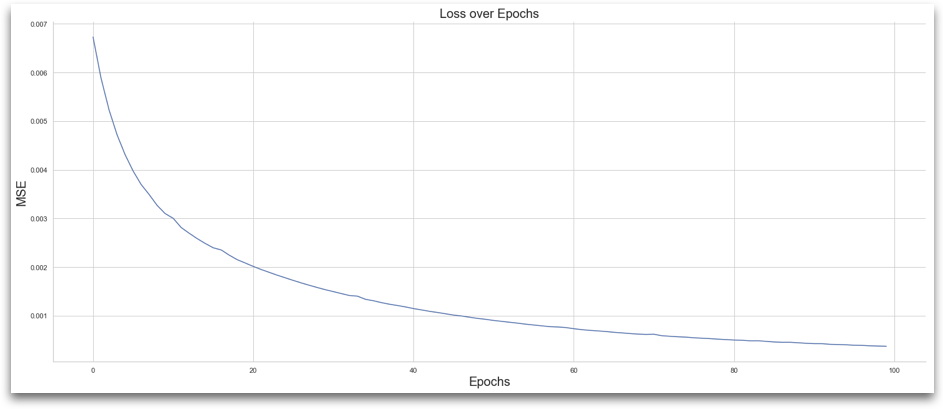

[](http://quantlet.de/)

## [](http://quantlet.de/) **DEDA_Class_2018_StGallen_NeuralNetworks** [](http://quantlet.de/)

```yaml


Name of Quantlet: 'DEDA_Class_2018_StGallen_NeuralNetworks'

Published in: 'Unpublished'

Description: 'This Quantlet contains one of two analyses that explore the relationship between weather data
 and stock returns. TrainNeuralNetwork.py sequentially runs different
 configurations of neural networks, aiming to predict stock returns from weather data.'

Keywords:
- weather
- stocks
- returns
- Neural Networks
- LSTM

Author: 
- Willy Apelt
- Jan-Gunther Gosselke
- Simon Sommer
- Ludovic Tuchschmid

See also:
- DEDA_Class_2018_StGallen_OLSandARMA

Submitted: '14th November 2018'

Datafile:
- sample_data/

Example:
- NN_loss.png

```



### PYTHON Code
```python

# -*- coding: utf-8 -*-
"""
Created on Wed Oct 31 11:26:09 2018
"""
import os
import pickle
import pandas as pd
import numpy as np

from sklearn import preprocessing

# local imports from utils folder
import utils.NN as NN
import utils.descriptive as de
import utils.loading_data as ld

# making a directory to save plots:
try:
    os.mkdir("plots")
except FileExistsError:
    pass

np.set_printoptions(suppress=True)


def main():
    # loading the data
    # weather_path = "./data/Weather_ALL.csv"
    # stock_path = "./data/StockIndices.csv"

    weather_path = "./sample_data/sample_Weather_ALL.csv"
    stock_path = "./sample_data/sample_StockIndices.csv"

    if "sample" in stock_path:
        print("\nxxxxxxxxxxxxxxxxx ATTENTION xxxxxxxxxxxxxxxxxxxx \n")
        print("This is only a small sample of the dataset (October 2018)")
        print(
            "The data is proprietary and could therefore not be provided in full"
        )
        print(
            "For meaningful results, please add more data in the same format")
        print("\n\n")

    # Loading the data
    price_data_list, weather_per_city = ld.load_data(stock_path, weather_path)
    return_data_list = calculate_returns(price_data_list)

    # Descriptive Statistics for weather data
    print("\nCreating plots...\n")  # only makes sense with more data
    # de.temp_descriptive(weather_per_city)

    # Creating and saving Histograms of returns of all indices
    # for index in return_data_list:
    #    de.plot_histogram(return_data_list[index]['Return'], index)

    train_NN_on_returns(stock_path, weather_path)
    # train_NN_on_prices(stock_path, weather_path)

def save_to_pickle(data, filename):
    with open("./" + filename, 'wb') as handle:
        pickle.dump(data, handle, protocol=pickle.HIGHEST_PROTOCOL)


def train_NN_on_prices(stock_path, weather_path):
    min_max_scaler = preprocessing.MinMaxScaler()
    price_losses_l1 = {}
    price_losses_l2 = {}
    price_losses_l2_relu = {}
    price_losses_lstm = {}

    price_data_list, weather_per_city = ld.load_data(stock_path, weather_path)

    for price_data in price_data_list:
        # Neural Net Data
        print('------\n------\n------\n' + price_data + '\n------')
        data = price_data_list[price_data].pivot_table(
            index=["Date", "Price Close"],
            columns='City',
            values=[
                'Mean Temperature Actual', 'Low Temperature Actual',
                'High Temperature Actual', 'Precipitation Actual',
                'Wind Speed Actual', 'Relative Humidity Actual'
            ]).reset_index(level=['Price Close']).dropna(
                axis=0, how="any")
        Y = data['Price Close'].to_frame().values
        X = min_max_scaler.fit_transform(
            data.drop("Price Close", axis=1).values)
        print('------\n------\n------\n One hidden layer\n------')
        price_losses_l1[price_data] = NN.Fully_Connected_OneL(X, Y)
        print('------\n------\n------\n Two hidden layers\n------')
        price_losses_l2_relu[price_data] = NN.Fully_Connected_TwoL_relu(X, Y)
        print('------\n------\n------\n Two hidden layers\n------')
        price_losses_l2[price_data] = NN.Fully_Connected_TwoL(X, Y)

        # LSTM
        print('------\n------\n------\n One hidden layer\n------')
        lstm_X = X[2:-2]
        lstm_Y = Y[2:-2]
        samples = list()
        samples_results = list()
        length = 130
        # step over the 5,000 in jumps of 200
        for i in range(0, len(lstm_X), length):
            # grab from i to i + 200
            sample = lstm_X[i:i + length]
            sample_result = lstm_Y[i:i + length]
            samples.append(sample)
            samples_results.append(sample_result)
        X_array = np.array(samples)
        X_array = X_array.reshape((len(samples), length, 42))
        Y_array = np.array(samples_results)
        Y_array = Y_array.reshape((len(samples_results), length, 1))
        price_losses_lstm[price_data] = NN.build_LSTM(X_array, Y_array, length)


def train_NN_on_returns(stock_path, weather_path):
    min_max_scaler = preprocessing.MinMaxScaler()
    return_losses_l1 = {}
    return_losses_l2 = {}
    return_losses_l2_relu = {}
    return_losses_lstm = {}

    price_data_list, weather_per_city = ld.load_data(stock_path, weather_path)
    return_data_list = calculate_returns(price_data_list)

    for return_data in return_data_list:
        # Neural Net Data

        print('------\n------\n------\n' + return_data + '\n------')
        data = return_data_list[return_data].pivot_table(
            index=["Date", "Return"],
            columns='City',
            values=[
                'Mean Temperature Actual', 'Low Temperature Actual',
                'High Temperature Actual', 'Precipitation Actual',
                'Wind Speed Actual', 'Relative Humidity Actual'
            ]).reset_index(level=['Return']).dropna(
                axis=0, how="any")

        Y = data['Return'].to_frame().values
        X = min_max_scaler.fit_transform(data.drop("Return", axis=1).values)
        print('------\n------\n------\n One hidden layer\n------')
        return_losses_l1[return_data] = NN.Fully_Connected_OneL(X, Y)
        print('------\n------\n------\n Two hidden layers\n------')
        return_losses_l2_relu[return_data] = NN.Fully_Connected_TwoL_relu(X, Y)
        print('------\n------\n------\n Two hidden layers\n------')
        return_losses_l2[return_data] = NN.Fully_Connected_TwoL(X, Y)

        # LSTM
        print('------\n------\n------\n One hidden layer\n------')
        lstm_X = X[:-2]
        lstm_Y = Y[:-2]
        samples = list()
        samples_results = list()
        length = 130
        # step over the 5,000 in jumps of 200
        for i in range(0, len(lstm_X), length):
            # grab from i to i + 200
            sample = lstm_X[i:i + length]
            sample_result = lstm_Y[i:i + length]
            samples.append(sample)
            samples_results.append(sample_result)
        X_array = np.array(samples)
        X_array = X_array.reshape((len(samples), length, 42))
        Y_array = np.array(samples_results)
        Y_array = Y_array.reshape((len(samples_results), length, 1))
        return_losses_lstm[return_data] = NN.build_LSTM(
            X_array, Y_array, length)


def calculate_returns(price_data_list):
    return_data_list = {}
    for index in price_data_list:
        return_data_list[index] = pd.DataFrame(
            columns=list(price_data_list[index]))
        return_data_list[index].rename(
            columns={'Price Close': 'Return'}, inplace=True)
        for city in price_data_list[index].City.unique():
            ordered_returns = price_data_list[index][
                price_data_list[index]["City"] == city].sort_values(by="Date")
            ordered_returns.rename(
                columns={'Price Close': 'Return'}, inplace=True)
            ordered_returns["Return"] = np.log(
                ordered_returns['Return']) - np.log(
                    ordered_returns['Return'].shift(periods=1))
            return_data_list[index] = pd.concat(
                [return_data_list[index], ordered_returns]).dropna(
                    axis=0, how="any")

    return return_data_list


if __name__ == "__main__":
    main()

```

automatically created on 2018-11-22