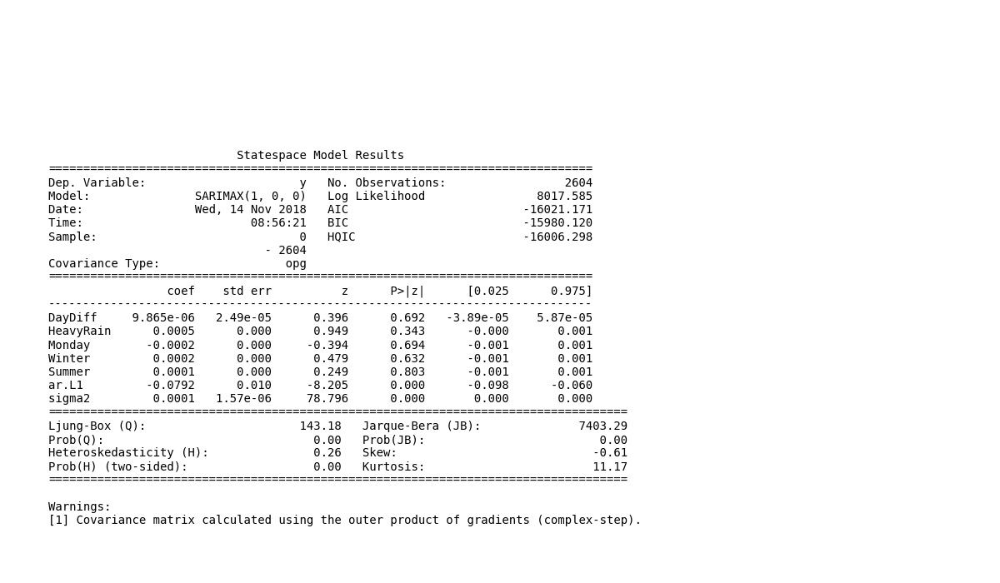
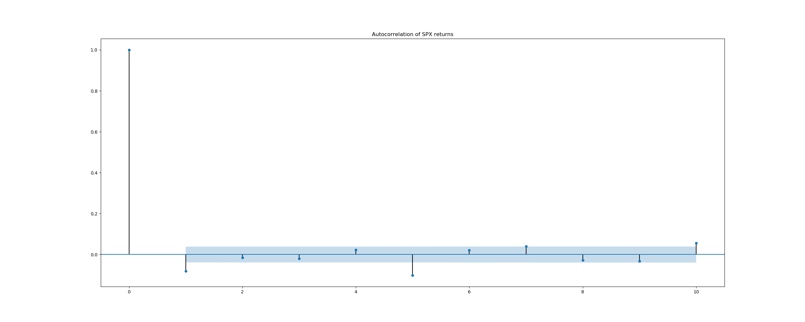
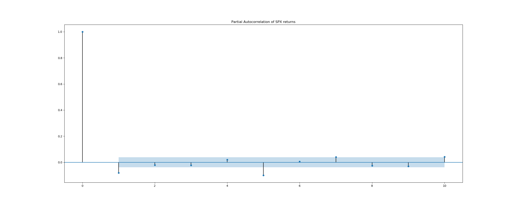

[](http://quantlet.de/)

## [](http://quantlet.de/) **DEDA_Class_2018_StGallen_OLSandARMA** [](http://quantlet.de/)

```yaml


Name of Quantlet: 'DEDA_Class_2018_StGallen_OLSandARMA'

Published in: 'Unpublished'

Description: 'This Quantlet contains one of two analyses that explore the relationship between weather data
 and stock returns. RunOLSandARMA.py estimates parameters of different linear and autoregressive models.'

Keywords:
- weather
- stocks
- returns
- OLS
- ARMA
- Neural Networks
- LSTM

Author: 
- Willy Apelt
- Jan-Gunther Gosselke
- Simon Sommer
- Ludovic Tuchschmid

See also:
- DEDA_Class_2018_StGallen_NeuralNetworks

Submitted: '14th November 2018'

Datafile:
- sample_data/

Example:
- OLS_1_SPX_New York_OLS.png
- ARMA11_inclexvar_SPX_OLS_global.png
- acf_SPX_returns.png
- pacf_SPX_returns.png

```








### PYTHON Code
```python

# -*- coding: utf-8 -*-
import os
import pandas as pd
import numpy as np
import statsmodels.api as sm
import matplotlib.pyplot as plt

from statsmodels.tsa.statespace.sarimax import SARIMAX
from statsmodels.graphics.tsaplots import plot_acf
from statsmodels.graphics.tsaplots import plot_pacf

# local imports from utils folder
import utils.loading_data as ld

# making a directory to save plots if not existing:
try:
    os.mkdir("plots")
except FileExistsError:
    pass

np.set_printoptions(suppress=True)


# loading the data
weather_path = "./sample_data/sample_Weather_ALL.csv"
stock_path = "./sample_data/sample_StockIndices.csv"
# weather_path = "./data/Weather_ALL.csv"
# stock_path = "./data/StockIndices.csv"

index = "SPX"
# options: SSMI, SPX, NDX, IXIC, SSMI, N225, FTSE

city = "New York"

# options: Boston, Chicago, London, New York, San Francisco, Zurich


def main():
    OLS_and_ARMA(index, city)
    OLS_global(index)

    if "sample" in stock_path:
        print("\nxxxxxxxxxxxxxxxxx ATTENTION xxxxxxxxxxxxxxxxxxxx \n" +
            "This is only a small sample of the dataset (October 2018)" +
             "The data is proprietary and could therefore not be provided in full \n" +
            "For meaningful results, please add more data in the same format \n\n")


def OLS_and_ARMA(index, city):

    print("\nRunning regression on {} using weather conditions in {}...\n".
          format(index, city))

    stock_index, weather = ld.load_data_OLS(stock_path, weather_path, index)
    # Merging prices and weather
    data = pd.merge(stock_index, weather, on='Date')
    data = data[data['City'] == city]

    # Generate weather binaries
    data['VeryCold'] = np.where(
        data['Mean Temperature Actual'] <= np.percentile(data['Mean Temperature Actual'], q=25), 1, 0)

    data['HeavyRain'] = np.where(
        data['Precipitation Actual'] >= np.percentile(data['Precipitation Actual'], q=75), 1, 0)

    data['ColdRain'] = data['HeavyRain'] * data['VeryCold']

    # Generate season binaries
    data['weekday'] = data.index.dayofweek
    data['month'] = data.index.month

    data['Monday'] = np.where(data['weekday'] == 0, 1, 0)
    data['Winter'] = np.where(
        (data['month'] == 11) | (data['month'] == 12) | (data['month'] == 1), 1, 0)

    data['Summer'] = np.where(
        (data['month'] == 6) | (data['month'] == 7) | (data['month'] == 8), 1, 0)

    data['DayDiff'] = data['High Temperature Actual'] - \
        data['Low Temperature Actual']

    # MODEL1:
    # return_t = return_t-1 + binaryCOLD + binaryRAIN + interactionCOLDRAIN + binaryWINTER + binarySOMMER + binaryMONDAY

    data['Return'] = np.log(data['Price Close'] / data['Price Close'].shift(1))

    data['LagReturn'] = data['Return'].shift(periods=-1)
    data_cut = data[1:]
    X = data_cut[[
        'LagReturn', 'VeryCold', 'HeavyRain', 'ColdRain', 'Monday', 'Winter', 'Summer'
    ]]
    Y = data_cut['Return'].to_frame().values

    # Regressions:
    reg1 = sm.OLS(endog=Y, exog=X, missing='drop')
    results1 = reg1.fit()
    plot_and_save_stats(results1, "OLS_1_" + index + "_" + city)

    # MODEL2:
    # return_t = return_t-1 + DayDifference + binaryRAIN + binaryWINTER + binarySOMMER + binaryMONDAY

    # Choice of exogenous variables:
    X = data_cut[[
        'LagReturn', 'DayDiff', 'HeavyRain', 'Monday', 'Winter', 'Summer'
    ]]

    # Regressions:
    reg2 = sm.OLS(endog=Y, exog=X, missing='drop')
    results2 = reg2.fit()
    plot_and_save_stats(results2, "OLS_2_" + index + "_" + city)

    # ARMA #####################
    # acf & pacf
    fig, ax = plt.subplots(figsize=(25, 10))
    plot_acf(data_cut['Return'], lags=10, ax=ax)
    ax.set_title("Autocorrelation of {} returns".format(index))
    fig.savefig('./plots/acf_{}_returns.png'.format(index))
    plt.close()

    fig, ax = plt.subplots(figsize=(25, 10))
    plot_pacf(data_cut['Return'], lags=10, ax=ax)
    ax.set_title("Partial Autocorrelation of {} returns".format(index))
    fig.savefig('./plots/pacf_{}_returns.png'.format(index))
    plt.close()

    # ARMA11 NO exogenous variables
    model = SARIMAX(endog=Y, order=(1, 0, 1), enforce_stationarity=False)
    model_fit = model.fit(disp=1)
    plot_and_save_stats(model_fit, "ARMA11_noexvar_"+index)

    # Plot residual errors
    fig, ax = plt.subplots(figsize=(25, 10))
    residuals = pd.DataFrame(model_fit.resid)
    residuals.plot(ax=ax, title="Residuals")

    fig, ax = plt.subplots(figsize=(25, 10))
    plot_pacf(residuals, lags=10, ax=ax)
    ax.set_title("Autocorrelation of {} residuals".format(index))
    fig.savefig('./plots/pacf_{}_residuals.png'.format(index))
    plt.close()


    # ARMA11 with exogenous variables
    X = data_cut[['DayDiff', 'HeavyRain', 'Monday', 'Winter', 'Summer']]
    model2 = SARIMAX(
        endog=Y, exog=X, order=(1, 0, 0), enforce_stationarity=False)
    model_fit2 = model2.fit(disp=1)
    plot_and_save_stats(model_fit2, "ARMA11_inclexvar_"+index)


def OLS_global(index):
    print("\n==========================================================\n")
    print(
        "\nRunning regression on index {}, using binary variables for global weather conditions..."
        .format(index))
    stock_index, weather = ld.load_data_OLS(stock_path, weather_path, index)

    # Generate season binaries
    stock_index['weekday'] = stock_index.index.dayofweek
    stock_index['month'] = stock_index.index.month

    # Mondays are bad ^^
    stock_index['Monday'] = np.where(stock_index['weekday'] == 0, 1, 0)

    # Winter is November, December, January
    stock_index['Winter'] = np.where(
        (stock_index['month'] == 11) | (stock_index['month'] == 12) |
        (stock_index['month'] == 1), 1, 0)

    # Creating weather binaries for each city
    cities = dict()
    for city in weather['City'].unique():

        city_name = city
        city = weather[weather['City'] == city].copy()

        city['VeryCold'] = np.where(
            city['Mean Temperature Actual'] <= np.percentile(
                city['Mean Temperature Actual'], q=25), 1, 0)
        city['HeavyRain'] = np.where(
            city['Precipitation Actual'] >= np.percentile(
                city['Precipitation Actual'], q=75), 1, 0)
        city['ColdRain'] = city['HeavyRain'] * city['VeryCold']

        cities[city_name] = city

    # creating global weather binaries that are only true if it's in every city
    stock_index['global_cold'] = np.ones(len(stock_index))
    stock_index['global_rain'] = np.ones(len(stock_index))
    stock_index['global_coldrain'] = np.ones(len(stock_index))
    for city_name, city in cities.items():
        stock_index['global_cold'] = (stock_index['global_cold'] == 1) & (
            city['VeryCold'] == 1)
        stock_index['global_rain'] = (stock_index['global_rain'] == 1) & (
            city['HeavyRain'] == 1)
        stock_index['global_coldrain'] = (
            stock_index['global_coldrain'] == 1) & (city['ColdRain'] == 1)

    # convert to integers
    stock_index['global_cold'] = stock_index['global_cold'] * 1
    stock_index['global_rain'] = stock_index['global_rain'] * 1
    stock_index['global_coldrain'] = stock_index['global_coldrain'] * 1

    # calculating log returns
    stock_index['LogReturns'] = np.log(
        stock_index['Price Close'] / stock_index['Price Close'].shift(1))

    # doing the regression
    regressors = [
        'global_cold', 'global_rain', 'global_coldrain', 'weekday', 'month',
        'Monday', 'Winter'
    ]
    model, predictions = estimate_linear(stock_index.dropna(), 'LogReturns',
                                         regressors)

    plot_and_save_stats(model, index + "_global")

    print("Done :)\n")


def estimate_linear(df, dependent, regressors):
    y = df[dependent]
    X = sm.add_constant(df[regressors])
    model = sm.OLS(y, X).fit(cov_type='HAC', cov_kwds={'maxlags': 20})
    predictions = model.predict(X)
    return model, predictions


def plot_and_save_stats(model, name):
    plt.close()
    plt.rc('figure', figsize=(12, 7))
    # approach improved by OP -> monospace!
    plt.text(
        0.01,
        0.05,
        model.summary(), {'fontsize': 10},
        fontproperties='monospace')
    plt.axis('off')
    plt.tight_layout()
    filename = './plots/{}_OLS.png'.format(name)
    plt.savefig(filename)
    print("Saved regression results under {}\n".format(filename))
    plt.close()

if __name__ == "__main__":
    main()

```

automatically created on 2018-11-22